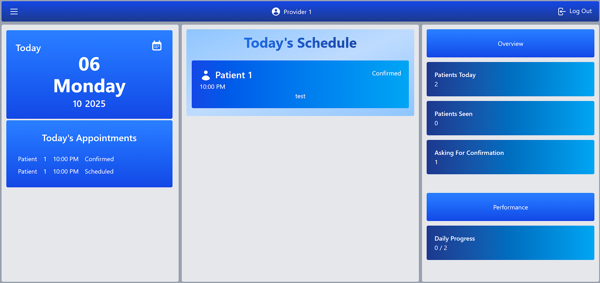
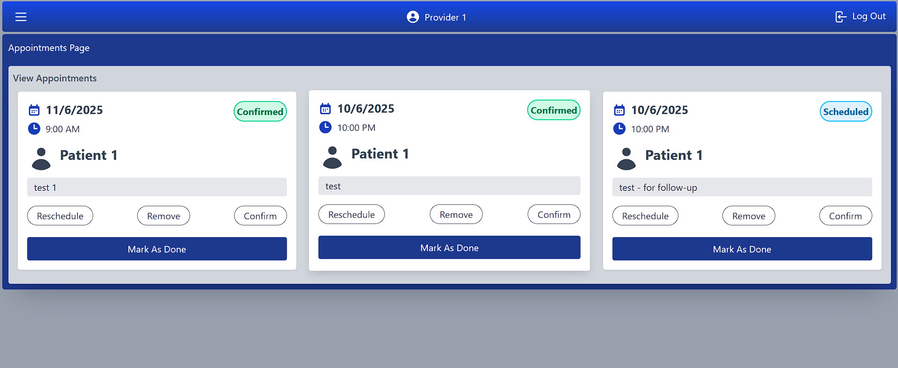
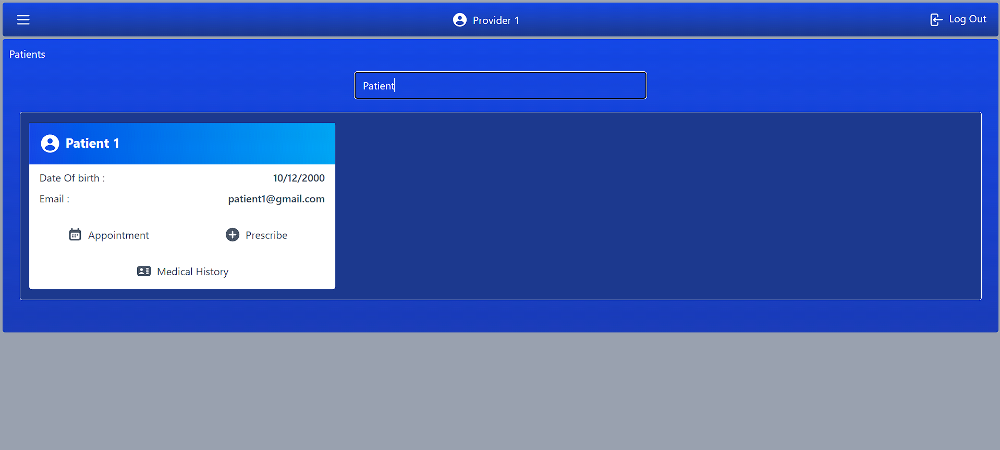
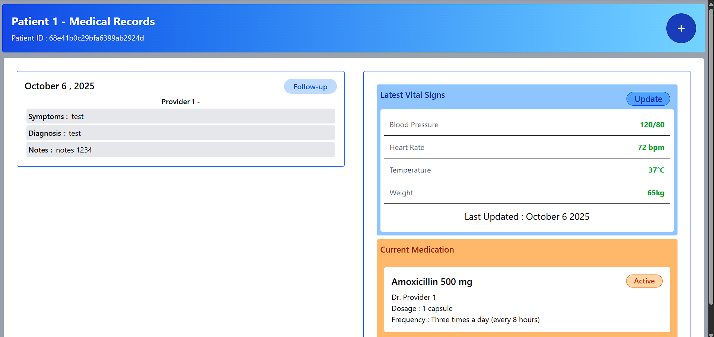
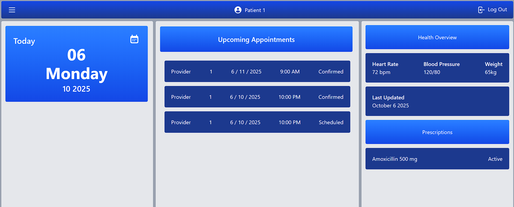
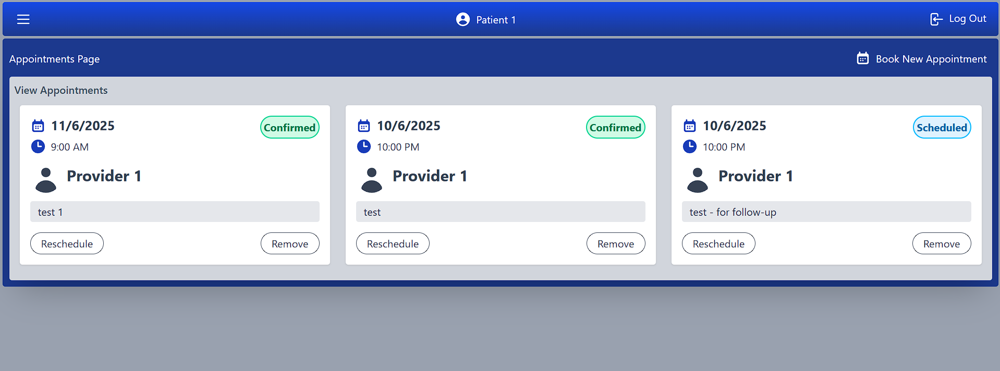
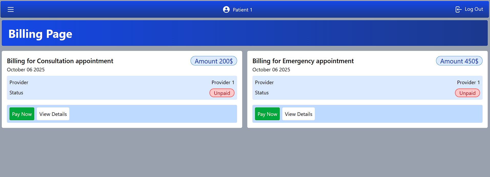

# Healthcare Management System

Modern full-stack MERN application for managing patients, staff, appointments, medications, medical records, and vital signs.

## Features

- **Patient Management** - Complete patient profiles with medical history
- **Staff Management** - Healthcare provider accounts and credentials
- **Appointment Scheduling** - Book, confirm, and track appointments
- **Medical Records** - Secure storage and retrieval of patient records
- **Medication Tracking** - Prescription and medication history management
- **Vital Signs Monitoring** - Track and visualize patient vitals over time
- **Secure Authentication** - JWT-based authentication and authorization

## Screenshots

## Provider View


*Main Provider dashboard overview*


*Appointment scheduling interface for providers*


*Search Page to find patient, buttons to add appointments, add prescriptions and open medical records Page*


*Add and update Patient Medical records*

## Patient View


*Main Patient dashboard overview*


*Appointments Page for Patients*


*Billings generated based on appointments the patient made after the provider confirms the appointment*

## Tech Stack

- **Frontend**: React, Vite, Tailwind CSS
- **Backend**: Node.js, Express.js
- **Database**: MongoDB with Mongoose ODM
- **Authentication**: JWT (JSON Web Tokens)

## Project Structure

```
.
├─ backend/
│  └─ Server/
│     ├─ index.js
│     ├─ authMiddlewere.js
│     ├─ models/
│     │  ├─ AppointmentModel.js
│     │  ├─ MedicalRecordsModel.js
│     │  ├─ MedicationModel.js
│     │  ├─ PatientModel.js
│     │  ├─ StaffModel.js
│     │  └─ VitalSignsModel.js
│     └─ routes/
│        ├─ AppointmentRoutes.js
│        ├─ MedicalRecordsRoutes.js
│        ├─ MedicationRoutes.js
│        ├─ PatientRoutes.js
│        ├─ StaffRoutes.js
│        └─ VitalSignsRoutes.js
└─ frontend/
   └─ src/
      ├─ Pages/
      ├─ Cards/
      │  ├─ StaffComponents/
      │  └─ PatientComponents/
      └─ assets/
```

## Quick Start

```bash
# Install dependencies
cd backend/Server && npm install
cd ../../frontend && npm install

# Run backend (Terminal 1)
cd backend/Server && npm start

# Run frontend (Terminal 2)
cd frontend && npm run dev
```

Backend: `http://localhost:3030`  
Frontend: `http://localhost:5173`

## Key Learnings

- Implemented secure JWT authentication and authorization
- Designed and integrated RESTful APIs with MongoDB
- Built responsive UI components with React and Tailwind CSS
